# Tēta Virtuve - Restaurant Booking System

This repository contains the code for Tēta Virtuve, a restaurant booking system. The application allows users to view the menu, book a table, and manage their bookings. It includes a full user authentication system for managing personal reservations.

## User interactions

### The client will interact with the website through a clear and straightforward series of steps.
#### Navigation: 
-Upon landing on the homepage, the client can use the navigation bar to find the main sections: the menu, the booking page, and their personal dashboard.
#### Booking a Table: 
-The primary interaction is making a reservation. The client will be presented with a booking form where they will:
-Enter their contact and party details.
-Select their preferred date and time from a drop-down list.
-Specify the number of guests.
-Click the "Book Now" button to submit their reservation.
#### Managing Bookings: 
-If a client has an account and is logged in, they can go to their dashboard to manage their existing bookings. 
#### This page lists all their reservations and provides two key options for each one:
-Edit: By clicking the "Edit" button, the client is taken to a form where they can change the details of their reservation.

-Cancel: The "Cancel" button leads to a separate confirmation page to prevent accidental cancellations. On this page, they must explicitly confirm their choice.
#### Notifications: The system will provide feedback to the client in the form of on-screen messages, which are styled as success, error, or informational banners to confirm that an action was successful or if an issue occurred.

## How to:
#### Main Navigation
The website provides multiple ways for users to navigate its content, ensuring a seamless experience for both logged-in and guest users.

-Tēta Virtuve (Logo): Clicking the restaurant's logo from any page will always take the user back to the main homepage.

-Home: This button serves the same function as the logo, returning the user to the website's main page.

-Menu: Users can view the restaurant's full menu, including daily specials and featured dishes.

-Book Table: This button allows both logged-in users and guests to make a reservation.

-Contact: Users can send a direct message to the restaurant.

#### Authentication
-Sign Up: Users can create a new account by providing a username, email, first and last name, and a password with confirmation.

-Login: This button directs existing users to the login page where they can access their account with their username and password.

#### Homepage Buttons
In the middle of the homepage, three prominent buttons are available for quick access, primarily for users who do not wish to log in.

-Make a Booking: Directs users to the booking form.

-See Menu: A secondary link to the restaurant's menu page.

-Cancel Booking: Allows users to cancel a booking made without an account.

#### The Dashboard
Once a user logs in, they are redirected to their personal Dashboard. This page is the central hub for managing bookings.

-View Bookings: Users can see a list of all their reservations.

-Edit Bookings: Users can modify an existing booking.

-Cancel Bookings: Users have the option to cancel a reservation.

### Main Page:

### Menu Page:


### Table Booking Page:


### Contact Page:


### Login Page:
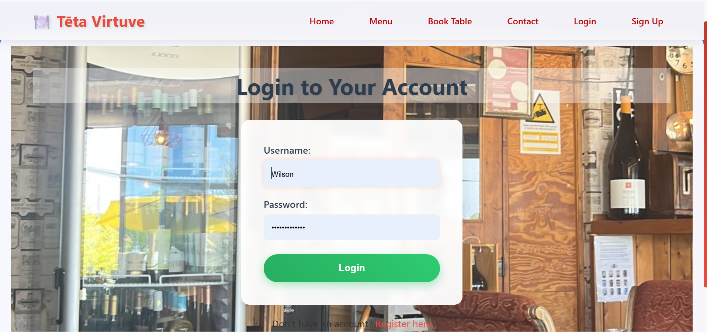
### Sign Up Page:


### Bookings Management Page:
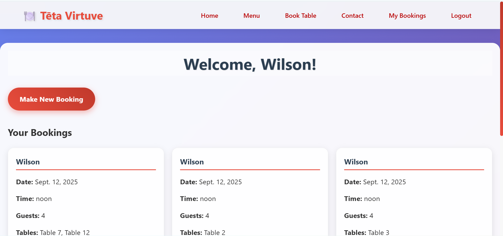

### Edit Page:


### Cancel Page:


## This project relies on the following key dependencies and credits:

### Dependencies:

Python: The core programming language used for the backend logic and Django framework.
Django: A high-level Python web framework that handles the entire application's backend, including the database, user authentication, and URL routing.
Django Messages: Django's built-in framework for displaying one-time notifications and feedback messages to the user.

### Credits:

Canvas.com: Used to compress all images on the website to improve load speeds and overall performance.
Django Documentation: A primary source for learning and implementing the framework's features and best practices.


## Bug, problems and solutions:
### False Positive: VS Code "Expression Expected" Error
Problem: VS Code shows an "Expression expected" linting error inside scrip tag.
Cause: This is a false positive because the linter is designed for pure JavaScript and does not recognize Django's templating syntax. It is not a bug in the code itself, and the application will run correctly.
Resolution: To resolve this in your local development environment, you need to configure VS Code to recognize Django templates. This can be done by adding a files.associations entry to your settings.json file. This tells the editor to treat .html files in specific directories as django-html, which will suppress these warnings.

I can certainly summarize the series of errors we've been tackling in your project, which primarily stem from Python 3.12 compatibility issues and the complexities of serving secure (HTTPS) content both locally and on Heroku.

Here is an extended breakdown of the critical errors and issues we encountered:

Summary of Project Errors and Resolutions
The core of our recent debugging session involved moving away from a conflicting setup to a robust, compatible solution. This required fixing a chain of dependency, command syntax, and deployment authentication issues.

1. Local HTTPS/Compatibility Errors
The initial problem and its direct consequence were rooted in an outdated package used for local HTTPS development:

Error Type	Issue Encountered	Root Cause
Initial SSL Error	AttributeError: module 'ssl' has no attribute 'wrap_socket'	The django-sslserver package was incompatible with Python 3.12, as Python 3.12 removed the legacy ssl.wrap_socket() function.
Deployment Dependency	ModuleNotFoundError: No module named 'dj_database_url'	Required packages were missing because django-sslserver wasn't included in requirements.txt, leading to an incomplete install after environment changes.
Command Misconfiguration	KeyError: 'runsslserver' and ModuleNotFoundError: No module named 'django.extensions'	Missing entry in INSTALLED_APPS for both sslserver and its replacement, django_extensions.
Final Local Fix	CommandError: "https" is not a valid port number... and CommandError: Werkzeug is required...	Incorrect command line syntax for runserver_plus and the missing Werkzeug library, which is a required dependency for the enhanced command.

Export to Sheets
Resolution: We abandoned the incompatible django-sslserver and switched to django-extensions, resolving all local HTTPS issues using the correct command: python manage.py runserver_plus --cert cert.pem.

2. Heroku Deployment and Authentication Errors
Once the local environment was stable, we faced significant obstacles connecting to and deploying on Heroku:

Error Type	Issue Encountered	Root Cause
CLI Path Error	bash: heroku: command not found	The Heroku CLI was not installed or its location was not added to the system's PATH variable (exacerbated by a 1024-character PATH limit on Windows, requiring a session-level workaround).
Git Remote Error	fatal: 'heroku' does not appear to be a git repository	The local Git repository had not been linked to the Heroku application, meaning the heroku remote did not exist.
App Naming Error	Error: Couldn't find that app.	A mismatch between the app name used in the command (milestone3-d43afd666373) and the app's actual Git remote name (milestone3).
Authentication Failure	VS Code asking for credentials for https://git.heroku.com	Git could not automatically fetch credentials, requiring manual entry of the Heroku account email (as the username) and a generated Heroku API Key (as the password/token).
Deployment Rejection	! Push rejected to milestone3. (pre-receive hook declined)	The commit being pushed had an identical SHA to the previous, failed deployment, forcing us to create a new "dummy" commit to get a unique identifier.

Export to Sheets
Resolution: We manually set the Heroku CLI path, fixed the Git remote name to https://git.heroku.com/milestone3.git, authenticated using the Heroku API Key, and created a new commit, finally allowing the code to be pushed to the server.


## Source for images and text:
All images below have been compressed using Canvas.com to help with load speed on the website.

All images were taken by me for the single porpose of this project.

The text "font-family: 'Segoe UI', Tahoma, Geneva, Verdana, sans-serif;" is a base font from the system, by choosing Segoe UI, I've prioritized speed and reliability, as it's a font that's already available on most modern computers.


## Deployment process:
Running the project locally:
1. Ensure you have a GitHub account [Create one here](https://docs.github.com/en/get-started/start-your-journey/creating-an-account-on-github).
2. Use Google Chrome as the best browser for this deployment.
3. Install VSCode to your computer or open the browser version [here](https://vscode.dev/).
4. Click the 'Open Remote Repository' button on the home page to clone and or edit as you wish.

To do the above you may need to follow these steps also:
1. Open the repository in GitHub [here](https://github.com/Wald13/Milestone3)
2. Click on the "Code" icon'.
3. Select "GitHub CLI".
4. Copy the CLI "gh repo clone (Name of the project).
5. Paste it in vscode terminal.
6. Use "pip install -r requirements.txt" to install the packages required.

### 2. Heroku Deployment (Back-End)

1. Log into your [Heroku Dashboard](https://dashboard.heroku.com/apps).
2. Click **New → Create new app**.
3. Enter a unique app name and select your region.
4. Click **Create app**.

#### Database Setup

5. Go to the **Resources** tab.
6. In the **Add-ons** search bar, find **Heroku Postgres** and select it.
7. Choose the plan **Essential-0** and submit.

#### Configuring Environment Variables

8. Navigate to the **Settings** tab → **Reveal Config Vars**.
9. Copy the `DATABASE_URL` provided.
10. In your local project (GitPod or IDE), create a new `env.py` file in the top-level directory.
11. Inside `env.py`, add:

```python
import os
os.environ["DATABASE_URL"] = "Paste Heroku DATABASE_URL here"
os.environ["SECRET_KEY"] = "yourRandomSecretKey"
```

12. Back in Heroku, add the same `SECRET_KEY` in **Config Vars**.

### Django Settings Update

13. In `settings.py`:

* Replace the hardcoded secret with:

  ```python
  SECRET_KEY = os.environ.get("SECRET_KEY")
  ```
* Update the database config:

  ```python
  DATABASES = {
      'default': dj_database_url.parse(os.environ.get("DATABASE_URL"))
  }
  ```

14. Save all files, then run migrations:

```bash
python manage.py migrate
```

## Testing:

I have been testing most aspects as I write the code for the site.

### Testing as a user for navigation purposes:
-Tested all links and buttons to ensure they lead to the correct pages.

-Successfully performed user sign-in and sign-out.

-Validated the booking process by creating a new booking, including testing with different times and dates.

-Confirmed the booking validation for invalid inputs, such as past dates, which correctly displayed an error message.

-Verified the ability to view, edit, and cancel existing bookings from the user dashboard.

### Testing with validators:

URL Structure
The URL configuration has been refined to ensure clarity and to resolve potential conflicts that could lead to 404 errors in specific scenarios, such as when crawlers attempt to access protected pages. The dashboard and booking management URLs are now distinctly defined.

SEO Improvements
The base.html template has been updated to include a robots meta tag. This tag explicitly instructs search engine crawlers to index, follow the pages, which is a key step in improving the site's visibility and search engine ranking. This change addresses the negative SEO flags seen in page speed tests on public-facing pages.

Addressing 404 and NONE,NOARCHIVE Issues
The 404 Not Found errors and the NONE,NOARCHIVE robots tag that appear during page speed tests on URLs like /dashboard/ are not a code issue. They are a result of the test crawler being unauthenticated. Since these are private, user-specific pages, the server correctly denies access and returns an error page. To get an accurate SEO score, you must only test public-facing URLs such as the homepage, menu, and contact pages.

Identified Issues and Resolutions
Issue: Page speed tests returned a 404 Not Found status and an incorrect NONE,NOARCHIVE robots tag for protected URLs (/dashboard/, /booking/5/edit/).

Cause: The page speed test crawler is not an authenticated user. The server correctly denies access to these private pages, serving an error page that is not meant for public indexing.

Resolution: The issue is not with the code, but with the test methodology. The fix is to only run page speed tests on public-facing URLs. This ensures the test crawler receives a 200 OK status code and a valid page to analyze, leading to an accurate SEO score.

Issue: The base.html file was missing a robots meta tag. While not the cause of the above issue, this is a general SEO best practice.

Cause: The meta tag was not included in the original template.

Resolution: Added <meta name="robots" content="index,follow"> to the <head> section of base.html to explicitly allow search engines to index and follow links on the site.

### Vendor-extended Pseudo-elements:
During CSS validation, warnings may appear for vendor-extended pseudo-elements. These are browser-specific CSS selectors, often prefixed with -webkit- (for Chrome and Safari), that are not yet part of the official W3C standard. We have chosen to include these to ensure consistent styling, particularly for elements like scrollbars, across different browsers. These are not errors and do not impact functionality.
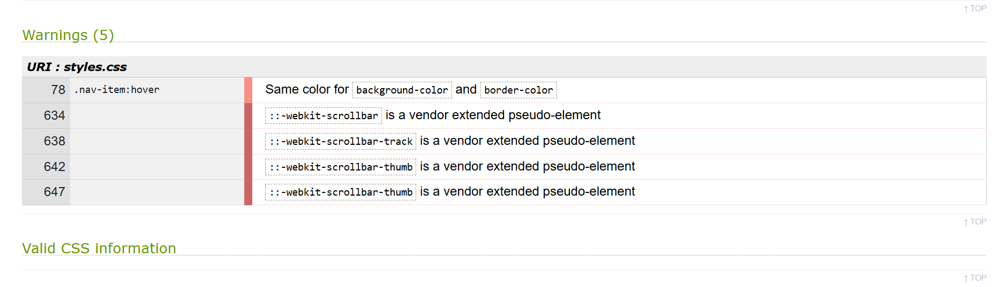

#### W3C HTML Validator:

Main Page:
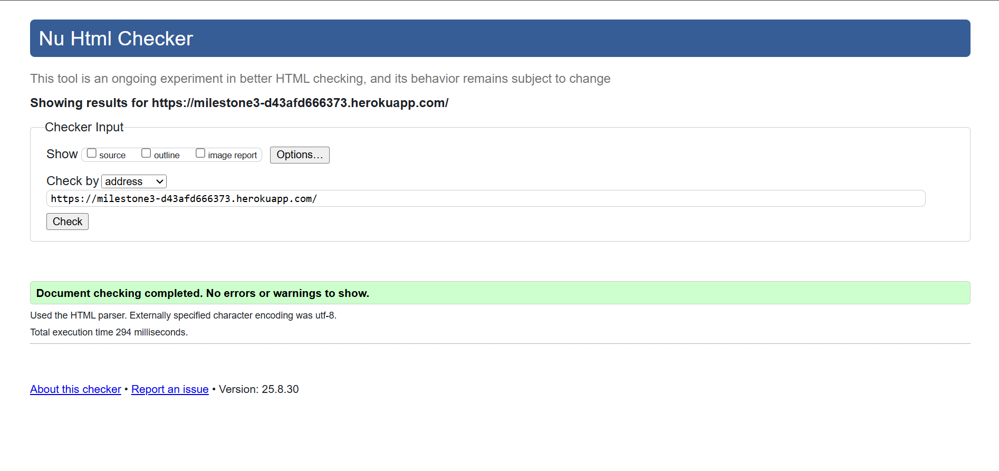

Menu Page:
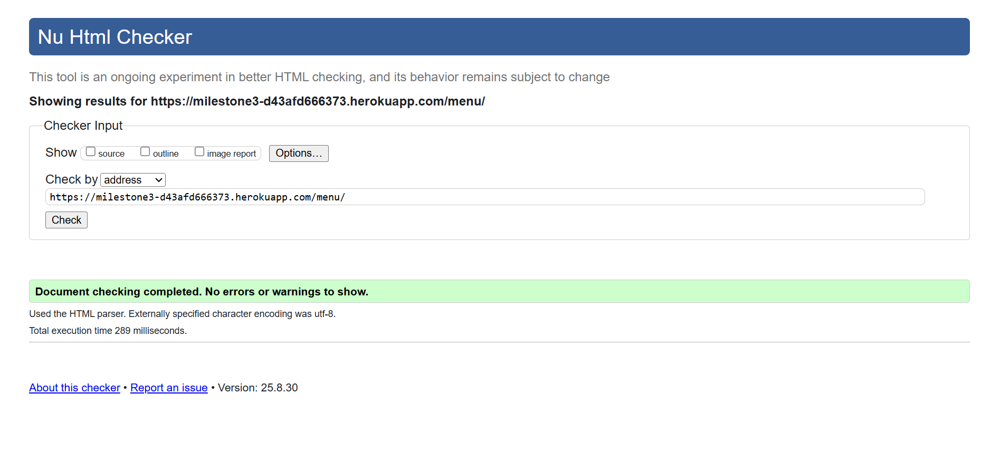

Book a table Page:


Contact Page:


Sing Up Page:
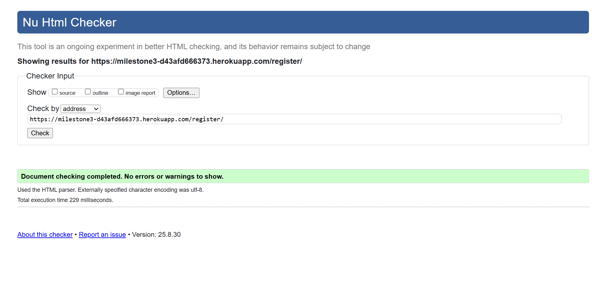

Login Page:


Full CSS Check:
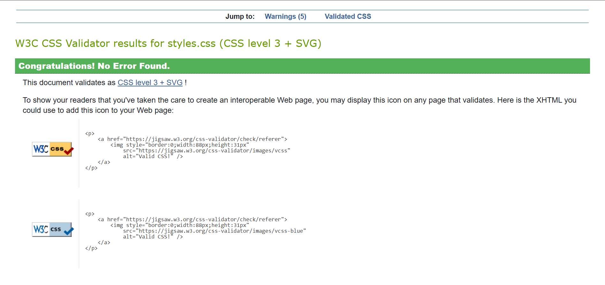

## Speed Validator:
### Main Page:
[https://pagespeed.web.dev/analysis/https-milestone3-d43afd666373-herokuapp-com/rnselgrrkx?form_factor=desktop]

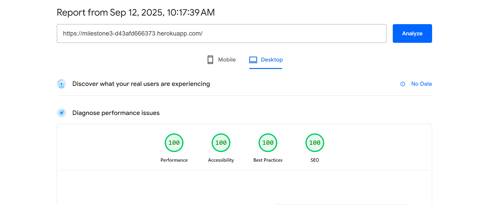 
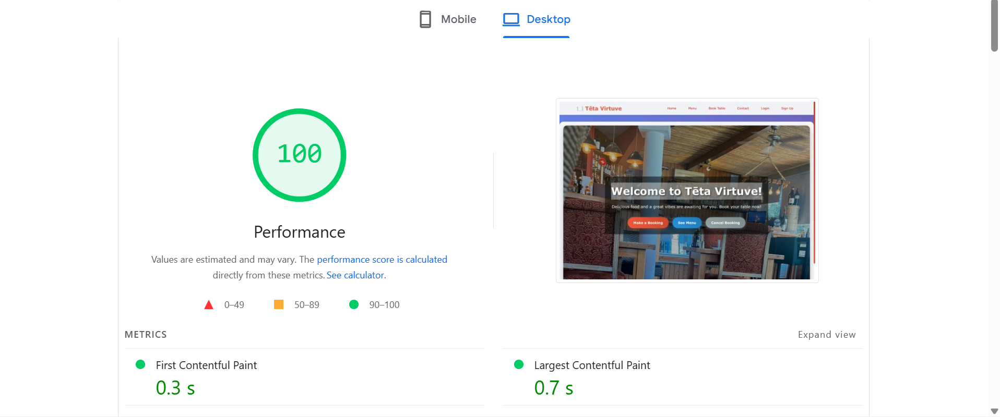 
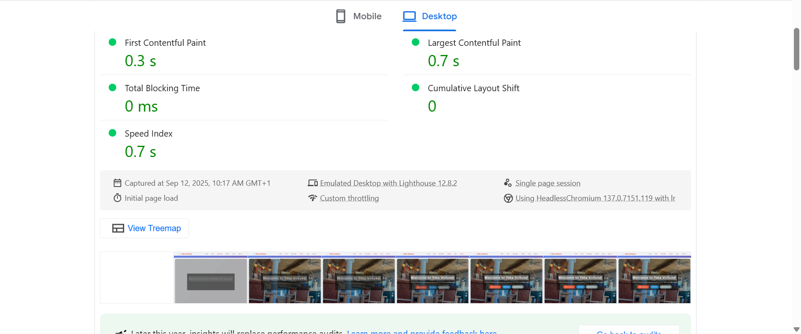 
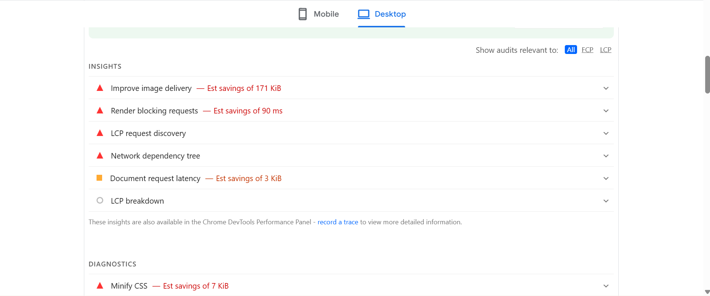 
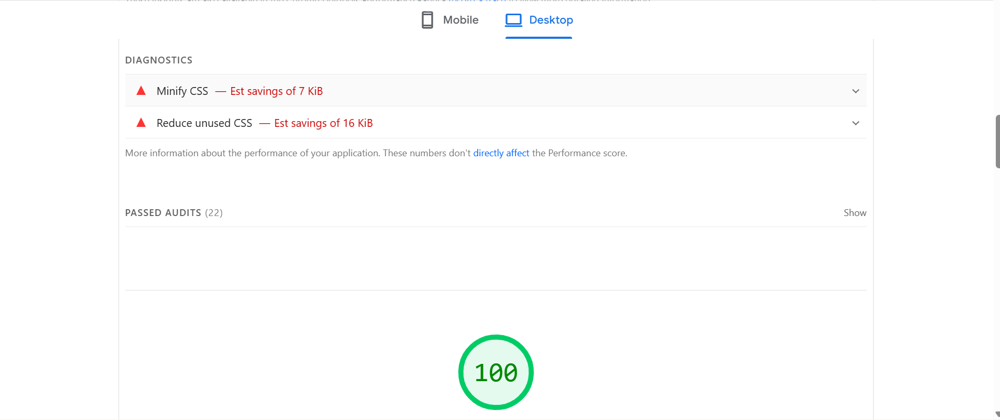 
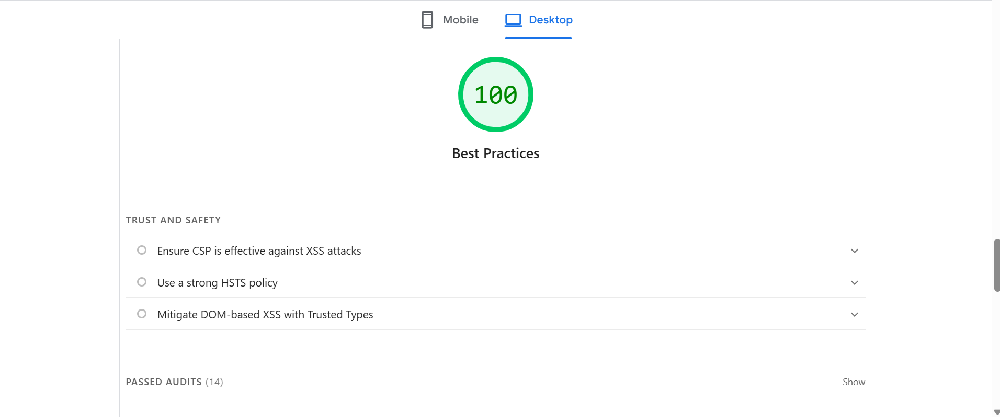 
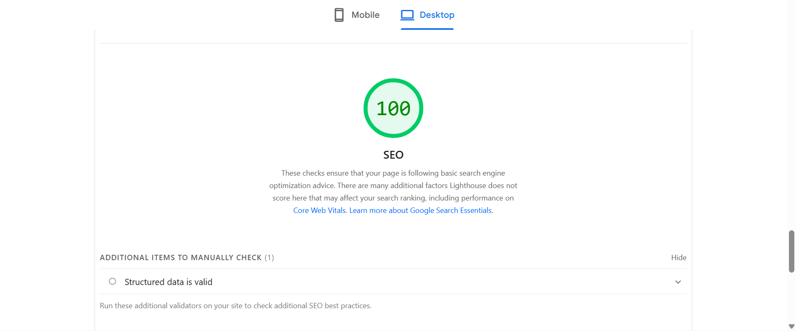

### Menu Page:
(https://pagespeed.web.dev/analysis/https-milestone3-d43afd666373-herokuapp-com-menu/fhi1y96qtf?form_factor=desktop)

### Book a Table Page:
(https://pagespeed.web.dev/analysis/https-milestone3-d43afd666373-herokuapp-com-book/zit4r9gfhk?form_factor=desktop)

### Contact Page:
(https://pagespeed.web.dev/analysis/https-milestone3-d43afd666373-herokuapp-com-contact/2lyjxmg5ft?form_factor=desktop)

### Sign Up Page:
(https://pagespeed.web.dev/analysis/https-milestone3-d43afd666373-herokuapp-com-register/6ln2x8r0u0?form_factor=desktop)

### Login Page:
(https://pagespeed.web.dev/analysis/https-milestone3-d43afd666373-herokuapp-com-login/cf5qe7mho7?form_factor=desktop)

### Dashboard Page:
(https://pagespeed.web.dev/analysis/https-milestone3-d43afd666373-herokuapp-com-dashboard/vuva0xab12?form_factor=desktop)

### Edit Page:
(https://pagespeed.web.dev/analysis/https-milestone3-d43afd666373-herokuapp-com-booking-7-edit/qm9r48bue1?form_factor=desktop)

### Cancel Page:
(https://pagespeed.web.dev/analysis/https-milestone3-d43afd666373-herokuapp-com-booking-7-delete/hqouvy4ln1?form_factor=desktop)