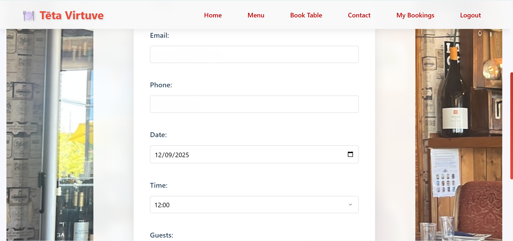

# Tēta Virtuve - Restaurant Booking System

This repository contains the code for Tēta Virtuve, a restaurant booking system. The application allows users to view the menu, book a table, and manage their bookings. It includes a full user authentication system for managing personal reservations.

## User interactions

### The client will interact with the website through a clear and straightforward series of steps.
#### Navigation: 
-Upon landing on the homepage, the client can use the navigation bar to find the main sections: the menu, the booking page, and their personal dashboard.
#### Booking a Table: 
-The primary interaction is making a reservation. The client will be presented with a booking form where they will:
-Enter their contact and party details.
-Select their preferred date and time from a drop-down list.
-Specify the number of guests.
-Click the "Book Now" button to submit their reservation.
#### Managing Bookings: 
-If a client has an account and is logged in, they can go to their dashboard to manage their existing bookings. 
#### This page lists all their reservations and provides two key options for each one:
-Edit: By clicking the "Edit" button, the client is taken to a form where they can change the details of their reservation.

-Cancel: The "Cancel" button leads to a separate confirmation page to prevent accidental cancellations. On this page, they must explicitly confirm their choice.
#### Notifications: The system will provide feedback to the client in the form of on-screen messages, which are styled as success, error, or informational banners to confirm that an action was successful or if an issue occurred.

## Wireframes:

## How to:
### Main Page:

### Menu Page:

### Table Booking Page:

### Contact Page:

### Login Page:

### Sign Up Page:

### Bookings Management Page:

### Edit Page:

### Cancel Page:

## This project relies on the following key dependencies and credits:

### Dependencies:

Python: The core programming language used for the backend logic and Django framework.
Django: A high-level Python web framework that handles the entire application's backend, including the database, user authentication, and URL routing.
Django Messages: Django's built-in framework for displaying one-time notifications and feedback messages to the user.

### Credits:

Canvas.com: Used to compress all images on the website to improve load speeds and overall performance.
Django Documentation: A primary source for learning and implementing the framework's features and best practices.

## Bug, problems and solutions:
### False Positive: VS Code "Expression Expected" Error
Problem: VS Code shows an "Expression expected" linting error inside scrip tag.
Cause: This is a false positive because the linter is designed for pure JavaScript and does not recognize Django's templating syntax. It is not a bug in the code itself, and the application will run correctly.
Resolution: To resolve this in your local development environment, you need to configure VS Code to recognize Django templates. This can be done by adding a files.associations entry to your settings.json file. This tells the editor to treat .html files in specific directories as django-html, which will suppress these warnings.

## Source for images and text:
All images below have been compressed using Canvas.com to help with load speed on the website.
All images were taken by me for the single porpose of this project.
The text "font-family: 'Segoe UI', Tahoma, Geneva, Verdana, sans-serif;" is a base font from the system, by choosing Segoe UI, I've prioritized speed and reliability, as it's a font that's already available on most modern computers.

## Deployment process:
Running the project locally:
1. Ensure you have a GitHub account [Create one here](https://docs.github.com/en/get-started/start-your-journey/creating-an-account-on-github).
2. Use Google Chrome as the best browser for this deployment.
3. Install VSCode to your computer or open the browser version [here](https://vscode.dev/).
4. Click the 'Open Remote Repository' button on the home page to clone and or edit as you wish.

To do the above you may need to follow these steps also:
1. Open the repository in GitHub [here](https://github.com/Wald13/Milestone3)
2. Click on the "Code" icon'.
3. Select "GitHub CLI".
4. Copy the CLI "gh repo clone (Name of the project).
5. Past it in or vscode terminal.
6. Use "pip install -r requirements.txt" to install the packages required.

## Testing:

As I have been testing most aspects as I write the code for the site, I am hoping this is not going to be too much.

### Testing as a user for navigation purposes:
-Tested all links and buttons to ensure they lead to the correct pages.
-Successfully performed user sign-in and sign-out.
-Validated the booking process by creating a new booking, including testing with different times and dates.
-Confirmed the booking validation for invalid inputs, such as past dates, which correctly displayed an error message.
-Verified the ability to view, edit, and cancel existing bookings from the user dashboard.

### Testing with validators:

URL Structure
The URL configuration has been refined to ensure clarity and to resolve potential conflicts that could lead to 404 errors in specific scenarios, such as when crawlers attempt to access protected pages. The dashboard and booking management URLs are now distinctly defined.

SEO Improvements
The base.html template has been updated to include a robots meta tag. This tag explicitly instructs search engine crawlers to index, follow the pages, which is a key step in improving the site's visibility and search engine ranking. This change addresses the negative SEO flags seen in page speed tests on public-facing pages.

Addressing 404 and NONE,NOARCHIVE Issues
The 404 Not Found errors and the NONE,NOARCHIVE robots tag that appear during page speed tests on URLs like /dashboard/ are not a code issue. They are a result of the test crawler being unauthenticated. Since these are private, user-specific pages, the server correctly denies access and returns an error page. To get an accurate SEO score, you must only test public-facing URLs such as the homepage, menu, and contact pages.

Identified Issues and Resolutions
Issue: Page speed tests returned a 404 Not Found status and an incorrect NONE,NOARCHIVE robots tag for protected URLs (/dashboard/, /booking/5/edit/).

Cause: The page speed test crawler is not an authenticated user. The server correctly denies access to these private pages, serving an error page that is not meant for public indexing.

Resolution: The issue is not with the code, but with the test methodology. The fix is to only run page speed tests on public-facing URLs. This ensures the test crawler receives a 200 OK status code and a valid page to analyze, leading to an accurate SEO score.

Issue: The base.html file was missing a robots meta tag. While not the cause of the above issue, this is a general SEO best practice.

Cause: The meta tag was not included in the original template.

Resolution: Added <meta name="robots" content="index,follow"> to the <head> section of base.html to explicitly allow search engines to index and follow links on the site.

### Vendor-extended Pseudo-elements:
During CSS validation, warnings may appear for vendor-extended pseudo-elements. These are browser-specific CSS selectors, often prefixed with -webkit- (for Chrome and Safari), that are not yet part of the official W3C standard. We have chosen to include these to ensure consistent styling, particularly for elements like scrollbars, across different browsers. These are not errors and do not impact functionality.